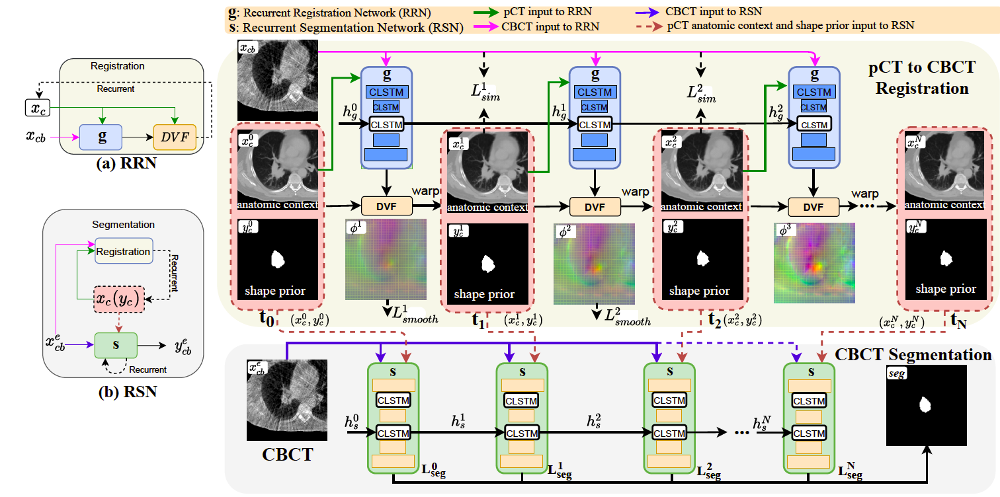

# One-Shot PACS
### Patient specific Anatomic Context and Shape prior aware recurrent registration-segmentation of longitudinal thoracic cone beam CTs 



---

## 📌 Overview
This repository provides the official implementation of **One-Shot PACS** [[Jiang & Veeraraghavan, *IEEE TMI 2022*](https://arxiv.org/pdf/2201.11000)], a recurrent registration–segmentation framework for longitudinal thoracic CBCTs with patient-specific anatomical context and shape priors.

---

## Prerequisites
- Linux
- Python 3.9
- NVIDIA GPU with CUDA CuDNN (CUDA 11.8 or higher)

---

## 🚀 Setup

#### 1. Clone this repository
```bash
git clone https://github.com/The-Veeraraghavan-Lab/OneShotPACS.git
cd OneShotPACS
```

#### 2. Create environment and install Pytorch (CUDA 11.8) with dependencies
- Install pytorch (our GPU is at CUDA 11.8, so we use the following command
```bash
pip install torch==2.1.0 torchvision==0.16.0 torchaudio==2.1.0 --index-url https://download.pytorch.org/whl/cu118
```
- Install the requirements
```bash
pip install -r requirements.txt
```

#### 3. Download the pretrained weights

Download the pretrained weights from [MSKCC Box](https://mskcc.box.com/s/bzdu41q3obdy0gb4ywf45o49w03ekdpg)  and and save them to `saved_weights` folder inside `sv_dir`

#### 4. Data organization

- The data should be present in the `dataset` folder, with the json organizing each instance under `validation` key as the following template:
  - datasets
    - imagefiles
      - image1
        - ct
          - *_image.nii.gz
          - *_label.nii.gz
        - cbct
          - *_image.nii.gz
          - *_label.nii.gz
      - image2
      - image3
      - ...
  
A corresponding **Decathlon-style JSON file** (e.g., `example.json`) should list cases under the `validation` key. The naming convention are as follows:
- Image volumes should end with **`_image`**  
- Segmentation labels should end with **`_label`**  

You can modify these conventions in `register_images.py` and `inference.py` if your dataset uses a different pattern.

## 🤖 Usage

#### Step 1: Pre-alignment
Register raw CT/CBCT pairs (optional if aligned data is already provided):

```bash
python register_images.py --path_images dataset/
```
This will save the pre-processed registered data in the same image directory under the `aligned_data` folder. Note, this step has already been executed for the set of reference images given as examples on  this page.

#### Step 2: Inference
Run registration and segmentation together using:

```bash
  python inference.py \
  --data_dir dataset \
  --json_list example.json \
  --sv_dir sv_dir \
  --val_dir inference_190 \
  --reg_model VoxelMorph \
  --reg_weights saved_weights/0190_reg.pt \
  --seg_model CLSTM \
  --seg_weights saved_weights/0190_seg.pt \
  --flownum 8 \
  --int_steps 7 \
  --int_downsize 2 \
  --bidir \
  —-a_min -500 —-a_max 500 —-b_min 0.0 —-b_max 1.0 \
  —-space_x 1.5 —-space_y 1.5 —-space_z 1.5 \
  —-roi_x 256 —-roi_y 256 —-roi_z 64 \
  --gpu 0 --batch_size 1 --workers 1
  ```

Generally, this means: 
```bash
python inference.py \
  --data_dir {/path/to/dataset} \
  --json_list {your_list.json in the dataset folder} \
  --sv_dir {/path/to/save/dir} \
  --val_dir {run_name} \
  --reg_model VoxelMorph \
  --reg_weights {path to your saved weights for registration model} \
  --seg_model CLSTM \
  --seg_weights {path to your saved weights for segmentation model} \
  --flownum 8 \
  --int_steps 7 \
  --int_downsize 2 \
  --bidir \ #uncomment if you do not want bidirectional cost
  —-a_min -500 —-a_max 500 —-b_min 0.0 —-b_max 1.0 \
  —-space_x 1.5 —-space_y 1.5 —-space_z 1.5 \
  —-roi_x 256 —-roi_y 256 —-roi_z 64 \
  --gpu 0 --batch_size 1 --workers 1
  # optional flags
  # --no_img_sv       # disable saving images
  # --cudnn-nondet    # allow non-deterministic CuDNN (faster, less reproducible)
  # --affine          # apply affine rotations
  # --rotate 10.0     # rotation in degrees if --affine is enabled
  # --trans 5         # translation in voxels if --affine is enabled
```
Running these steps should produce the outputs and a corresponding CSV at `sv_dir/inference_190`, the reference case sample results can be found <a href="https://mskcc.box.com/s/nxmkjqkllwjhv7se2flninlotyzrh6yn">here</a> for cross-verification.

## Citation
If you use this code for your research, please cite our paper <a href="https://arxiv.org/pdf/2201.11000">One shot PACS</a>:

```
@article{jiang2022one,
  title={One shot PACS: Patient specific Anatomic Context and Shape prior aware recurrent registration-segmentation of longitudinal thoracic cone beam CTs},
  author={Jiang, Jue and Veeraraghavan, Harini},
  journal={IEEE transactions on medical imaging},
  volume={41},
  number={8},
  pages={2021--2032},
  year={2022},
  publisher={IEEE}
}
```
